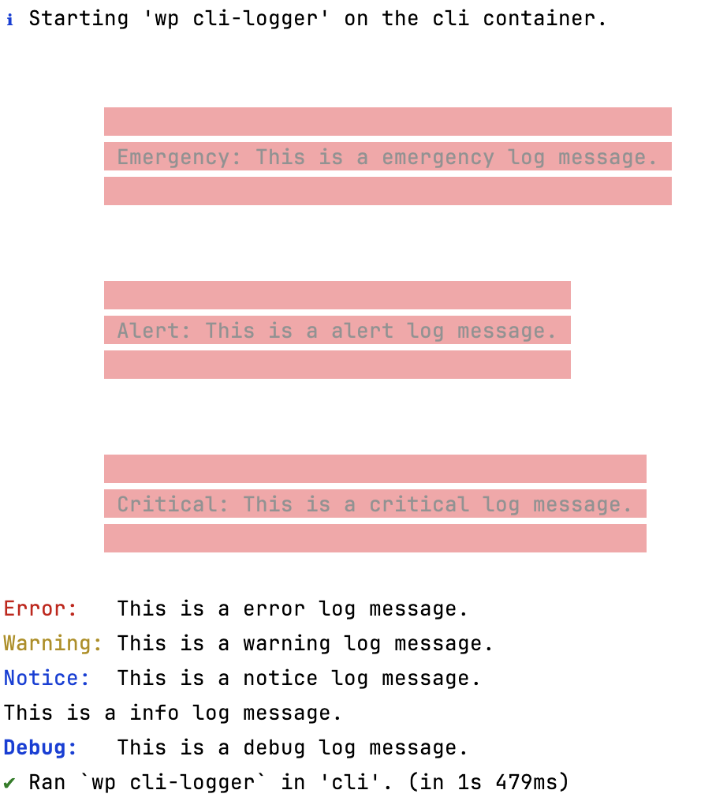

[](#) [](https://github.com/WordPress-Coding-Standards/WordPress-Coding-Standards) [](https://github.com/szepeviktor/phpstan-wordpress)

# WP CLI PSR Logger

A PSR logger which calls `WP_CLI::line()` with the level name coloured.

Allows easy separation of logic and presentation for CLI commands. I.e. no intermingling of `WP_CLI::line()` in main application code.

## Install

```
composer require brianhenryie/bh-wp-cli-logger
```

## Operation

```php
$logger = new \BrianHenryIE\WP_CLI_Logger\WP_CLI_Logger();
$logger->warning( 'Something happened!' );
```


* It is just a [PSR Logger Interface](https://www.php-fig.org/psr/psr-3/) implementation (aka a PSR-3 logger)
* It does not filter logs to above a certain level
* It does not record the logs anywhere

There is one filter for customising the output:

```php
/**
 * Filter logs to control output style.
 *
 * NB: try to use the `context` to only apply this filter to logs output by your own plugin.
 * Return null, an empty array, or an empty message to prevent output.
 *
 * @var ?array{level:string, message:string, context:array<mixed>, prepend:string, ansi_color:string} $log
 */
$log = apply_filters( 'bh_wp_cli_logger_log', $log );
```

## Try it out

```bash
composer install
npm install

npx wp-env start

npx wp-env run cli wp cli-logger
```



<details>

<summary>The test plugin CLI command has two options, levels and message:</summary>

```bash
NAME

  wp cli-logger

DESCRIPTION

  Test the WP_CLI PSR logger.

SYNOPSIS

  wp cli-logger [<levels>...] [--message=<message>]

  [<levels>...]
    Optional list of log levels to show.

  [--message=<message>]
    A message to use in the output. Replaces `{level}` in the template if present.
    ---
    default: "This is a {level} log message."
    ---

EXAMPLES

     # Print out a log message for notice
     $ wp test-plugin notice
     Notice:  This is a notice log message.

     # Print out a custom log message for warning
     $ wp test-plugin warning --message="Uh, oh... something looks amiss."
     Warning: Uh, oh... something looks amiss.

     # Print out a log messages for two levels
     $ wp test-plugin notice debug
     Notice:  This is a notice log message.
     Debug:   This is a debug log message.
 ```

</details>

Delete the Docker containers afterwards:

```bash
npx wp-env destroy
```

## Rationale

Error: red, warning: yellow, and notice: blue are the standard WordPress `admin_notice` colours.

Debug: blue is the standard WP_CLI debug colour.

Emergency, alert and critical use `WP_CLI::error_multi_line()`.

Info logs are not prepended with "Info: ", as other levels are. I'm not 100% set on this.

## TODO 

### Level Filtering

I imagine there is a Composer package that provides the same utility as WooCommerce's [WC_Logger::should_handle()](https://github.com/woocommerce/woocommerce/blob/fe8f3bb8195dea8c0f7e544a57df0d985d2dfc52/plugins/woocommerce/includes/class-wc-logger.php#L82-L93) function, and is extensible. If I come across one, I'll include it here.

When WP CLI commands are appended with `--debug` or more specifically `--debug=my-plugin-slug`, all messages _should_ be output. This should be part of any `::should_handle()` function. 

### psr/log >=2.0

This currently requires `"psr/log": "^1.0"`. [v2.0](https://github.com/php-fig/log/compare/1.1.4...2.0.0) requires PHP 8.0 and introduces parameter types; [3.0](https://github.com/php-fig/log/compare/2.0.0...3.0.0) then introduces return types. 

### Context

Context is not printed.

## See Also

* [BH WP Logger](https://github.com/BrianHenryIE/bh-wp-logger) – this class was extracted from that
* [BH Color Logger](https://github.com/BrianHenryIE/bh-color-logger) – like this, for unit tests